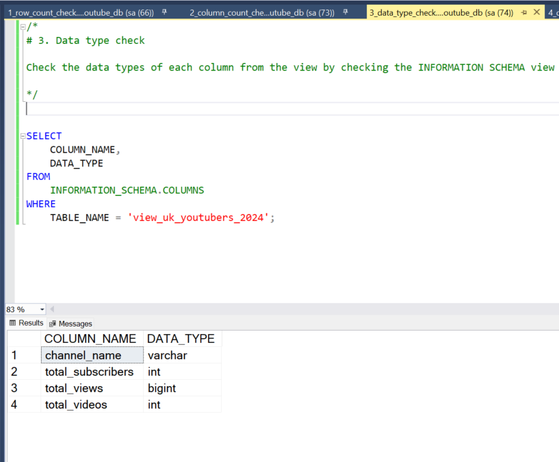
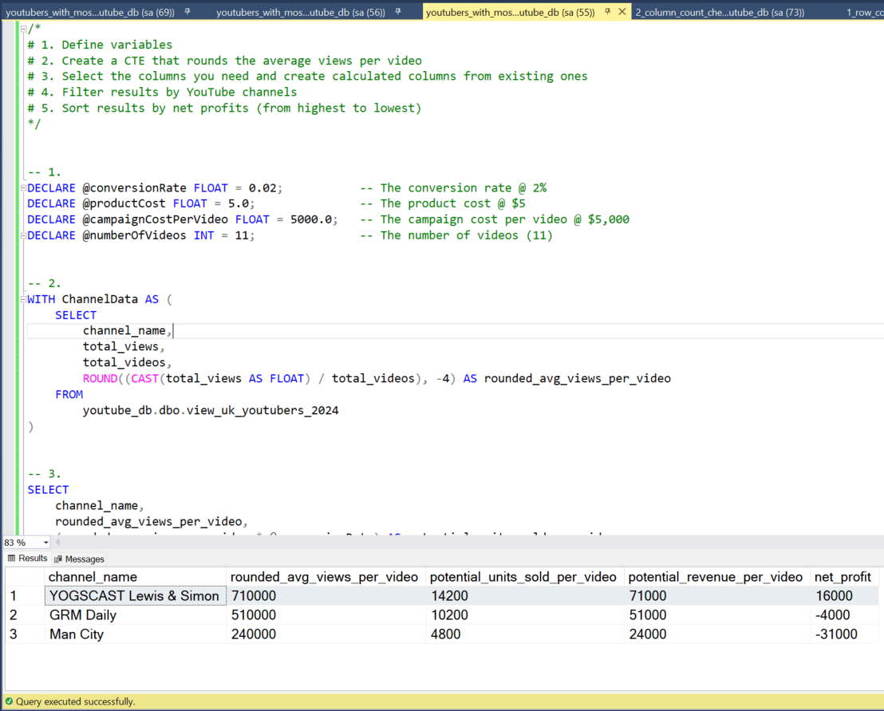

# John Olutubo


## YouTube Influencer marketing Analytics Project 


## Table of contents 

- [Objective](#objective)
- [Data Source](#data-source)
- [Stages](#stages)
- [Design](#design)
  - [Dashboard Mockup](#dashboard-mockup)
  - [Tools](#tools)
- [Development](#development)
  - [Pseudocode](#pseudocode)
  - [Data Exploration Notes](#data-exploration-notes)
  - [Data Cleaning](#data-cleaning)
  - [Transforming the Data](#transforming-the-data)
  - [Creating the SQL View](#creating-the-sql-view)
- [Data Quality Tests](#data-quality-tests)
- [Visualization](#visualization)
  - [Dashboard Overview](#dashboard-overview)
  - [DAX Measures](#dax-measures)
- [Analysis](#analysis)
  - [Findings](#findings)
  - [Validation](#validation)
  - [Discovery](#discovery)
- [Recommendations](#recommendations)
  - [Potential ROI](#potential-roi)
  - [Action Plan](#action-plan)
- [Conclusion](#conclusion)


## Objective

### Key Pain Point

The Head of Marketing in aims to identify the top YouTubers in the UK for 2024 to determine which influencers would be most effective for marketing campaigns throughout the year.

### Ideal Solution

A dashboard is needed to provide insights into the top UK YouTubers in 2024, including:

- Subscriber count
- Total views
- Total videos
- Engagement metrics

This dashboard will enable the marketing team to make informed decisions on collaborations with YouTubers.

### User Story

As the Head of Marketing, a dashboard analyzing YouTube channel data in the UK is needed to identify top-performing channels based on metrics such as subscriber base and average views. This will help in making informed collaboration decisions, maximizing the effectiveness of marketing campaigns.


## Data Source

### Data Requirements

Data on the top UK YouTubers in 2024 is required, including:

- Channel names
- Total subscribers
- Total views
- Total videos uploaded

### Data Origin

The data is sourced from Kaggle (an Excel extract). [Access the dataset here.](https://www.kaggle.com/datasets/bhavyadhingra00020/top-100-social-media-influencers-2024-countrywise?resource=download)


## Stages

- Design
- Developement
- Testing
- Analysis 
 


## Design

### Dashboard Components

The dashboard should address the following questions:

1. Who are the top 10 YouTubers with the most subscribers?
2. Which 3 channels have uploaded the most videos?
3. Which 3 channels have the most views?
4. Which 3 channels have the highest average views per video?
5. Which 3 channels have the highest views per subscriber ratio?
6. Which 3 channels have the highest subscriber engagement rate per video uploaded?

### Dashboard Mockup

Visuals:
1. Scorecards
2. Treemap
3. Horizontal bar chart 
4. Table


### Tools

| Tool        | Purpose                                      |
|-------------|----------------------------------------------|
| Excel       | Data exploration                             |
| SQL Server  | Data cleaning, testing, and analysis         |
| Power BI    | Data visualization via interactive dashboards|
| GitHub      | Project documentation and version control    |
| Mokkup AI   | Dashboard wireframe/mockup design            |

## Development

### Pseudocode

General approach:

1. Retrieve the data
2. Explore the data in Excel
3. Load the data into SQL Server
4. Clean the data using SQL
5. Test the data using SQL
6. Visualize the data in Power BI
7. Generate insights
8. Document and publish the findings

### Data Exploration Notes

Initial observations:

1. The dataset contains at least 4 necessary columns.
2. The first column includes channel IDs separated by '@'; channel names need to be extracted.
3. Some cells and headers are in a different language; this needs to be addressed.
4. Excess data is present; irrelevant columns need to be removed.


### Data Cleaning

Clean data should:

- Retain only relevant columns
- Have appropriate data types
- Contain no null values


Constraints:

| Property | Description |
| --- | --- |
| Number of Rows | 100 |
| Number of Columns | 4 |

Expected schema:

| Column Name       | Data Type | Nullable |
|-------------------|-----------|----------|
| channel_name      | VARCHAR   | NO       |
| total_subscribers | INTEGER   | NO       |
| total_views       | INTEGER   | NO       |
| total_videos      | INTEGER   | NO       |


### Transforming the data

1. Unnecessary columns are removed by selectively retaining those deemed necessary.
2. Youtube channel names are extracted from the first column.
3. Column renaming is performed utilizing aliases.


```sql
/*
# 1. Select the required columns
# 2. Extract the channel name from the 'NOMBRE' column
*/

-- 1.
SELECT
    SUBSTRING(NOMBRE, 1, CHARINDEX('@', NOMBRE) -1) AS channel_name,  -- 2.
    total_subscribers,
    total_views,
    total_videos

FROM
    top_uk_youtubers_2024
```


### Creating the SQL view 

```sql
/*
# 1. Create a view to store the transformed data
# 2. Cast the extracted channel name as VARCHAR(100)
# 3. Select the required columns from the top_uk_youtubers_2024 SQL table 
*/

-- 1.
CREATE VIEW view_uk_youtubers_2024 AS

-- 2.
SELECT
    CAST(SUBSTRING(NOMBRE, 1, CHARINDEX('@', NOMBRE) -1) AS VARCHAR(100)) AS channel_name, -- 2. 
    total_subscribers,
    total_views,
    total_videos

-- 3.
FROM
    top_uk_youtubers_2024

```


## Data Quality Tests

Here are the data quality tests conducted:

### Row count check
#### SQL QUERY
```sql
/*
# Count the total number of records (or rows) are in the SQL view
*/

SELECT
    COUNT(*) AS no_of_rows
FROM
    view_uk_youtubers_2024;

```
#### Output


### Column count check
#### SQL query 
```sql
/*
# Count the total number of columns (or fields) are in the SQL view
*/


SELECT
    COUNT(*) AS column_count
FROM
    INFORMATION_SCHEMA.COLUMNS
WHERE
    TABLE_NAME = 'view_uk_youtubers_2024'
```
#### Output 


### Data type check
#### SQL query 
```sql
/*
# Check the data types of each column from the view by checking the INFORMATION SCHEMA view
*/

-- 1.
SELECT
    COLUMN_NAME,
    DATA_TYPE
FROM
    INFORMATION_SCHEMA.COLUMNS
WHERE
    TABLE_NAME = 'view_uk_youtubers_2024';
```
#### Output



### Duplicate count check
#### SQL query 
```sql
/*
# 1. Check for duplicate rows in the view
# 2. Group by the channel name
# 3. Filter for groups with more than one row
*/

-- 1.
SELECT
    channel_name,
    COUNT(*) AS duplicate_count
FROM
    view_uk_youtubers_2024

-- 2.
GROUP BY
    channel_name

-- 3.
HAVING
    COUNT(*) > 1;
```
#### Output


## Visualization 

### Dashboard Overview


This visualization showcases the current standings of the Top UK Youtubers for the year 2024.


### DAX Measures

#### 1. Total Subscribers (M)
```sql
Total Subscribers (M) = 
VAR million = 1000000
VAR sumOfSubscribers = SUM(view_uk_youtubers_2024[total_subscribers])
VAR totalSubscribers = DIVIDE(sumOfSubscribers,million)

RETURN totalSubscribers

```

#### 2. Total Views (B)
```sql
Total Views (B) = 
VAR billion = 1000000000
VAR sumOfTotalViews = SUM(view_uk_youtubers_2024[total_views])
VAR totalViews = ROUND(sumOfTotalViews / billion, 2)

RETURN totalViews

```

#### 3. Total Videos
```sql
Total Videos = 
VAR totalVideos = SUM(view_uk_youtubers_2024[total_videos])

RETURN totalVideos

```

#### 4. Average Views Per Video (M)
```sql
Average Views per Video (M) = 
VAR sumOfTotalViews = SUM(view_uk_youtubers_2024[total_views])
VAR sumOfTotalVideos = SUM(view_uk_youtubers_2024[total_videos])
VAR  avgViewsPerVideo = DIVIDE(sumOfTotalViews,sumOfTotalVideos, BLANK())
VAR finalAvgViewsPerVideo = DIVIDE(avgViewsPerVideo, 1000000, BLANK())

RETURN finalAvgViewsPerVideo 

```


#### 5. Subscriber Engagement Rate
```sql
Subscriber Engagement Rate = 
VAR sumOfTotalSubscribers = SUM(view_uk_youtubers_2024[total_subscribers])
VAR sumOfTotalVideos = SUM(view_uk_youtubers_2024[total_videos])
VAR subscriberEngRate = DIVIDE(sumOfTotalSubscribers, sumOfTotalVideos, BLANK())

RETURN subscriberEngRate 

```


#### 6. Views per subscriber
```sql
Views Per Subscriber = 
VAR sumOfTotalViews = SUM(view_uk_youtubers_2024[total_views])
VAR sumOfTotalSubscribers = SUM(view_uk_youtubers_2024[total_subscribers])
VAR viewsPerSubscriber = DIVIDE(sumOfTotalViews, sumOfTotalSubscribers, BLANK())

RETURN viewsPerSubscriber 

```


## Analysis 

### Findings

Key questions addressed:

1. Who are the top 10 YouTubers with the most subscribers?
2. Which 3 channels have uploaded the most videos?
3. Which 3 channels have the most views?
4. Which 3 channels have the highest average views per video?
5. Which 3 channels have the highest views per subscriber ratio?
6. Which 3 channels have the highest subscriber engagement rate per video uploaded?


#### 1. Top 10 YouTubers by Subscribers

| Rank | Channel Name         | Subscribers (M) |
|------|----------------------|-----------------|
| 1    | NoCopyrightSounds    | 33.60           |
| 2    | DanTDM               | 28.60           |
| 3    | Dan Rhodes           | 26.50           |
| 4    | Miss Katy            | 24.50           |
| 5    | Mister Max           | 24.40           |
| 6    | KSI                  | 24.10           |
| 7    | Jelly                | 23.50           |
| 8    | Dua Lipa             | 23.30           |
| 9    | Sidemen              | 21.00           |
| 10   | Ali-A                | 18.90           |


#### 2. Top 3 channels with the Most Videos Uploaded

| Rank | Channel Name    | Videos Uploaded |
|------|-----------------|-----------------|
| 1    | GRM Daily       | 14,696          |
| 2    | Manchester City | 8,248           |
| 3    | Yogscast        | 6,435           |


#### 3. Top 3 channels with the Most Views


| Rank | Channel Name | Total Views (B) |
|------|--------------|-----------------|
| 1    | DanTDM       | 19.78           |
| 2    | Dan Rhodes   | 18.56           |
| 3    | Mister Max   | 15.97           |


#### 4. Top 3 channels with the Highest Average Views per Video

| Channel Name | Averge Views per Video (M) |
|--------------|-----------------|
| Mark Ronson  | 32.27           |
| Jessie J     | 5.97            |
| Dua Lipa     | 5.76            |


#### 5. Top 3 channels with the Highest Views per Subscriber Ratio

| Rank | Channel Name       | Views per Subscriber        |
|------|-----------------   |---------------------------- |
| 1    | GRM Daily          | 1185.79                     |
| 2    | Nickelodeon        | 1061.04                     |
| 3    | Disney Junior UK   | 1031.97                     |


#### 6. Top 3 channels with the Highest Subscriber Engagement Rate

| Rank | Channel Name    | Subscriber Engagement Rate  |
|------|-----------------|---------------------------- |
| 1    | Mark Ronson     | 343,000                     |
| 2    | Jessie J        | 110,416.67                  |
| 3    | Dua Lipa        | 104,954.95                  |


#### Notes

For this analysis, the focus is on metrics crucial for determining the expected ROI for the marketing client. These metrics primarily include:

- Subscribers
- Total views
- Videos uploaded


### Validation 

#### 1. Youtubers with the most subscribers 

_Calculation breakdown_

**Campaign Idea:** Product Placement

1. **NoCopyrightSounds**
   - Average views per video: 6.92 million
   - Product cost: $5
   - Potential units sold per video: 6.92 million x 2% conversion rate = 138,400 units sold
   - Potential revenue per video: 138,400 x $5 = $692,000
   - Campaign cost (one-time fee): $50,000
   - **Net profit: $692,000 - $50,000 = $642,000**

2. **DanTDM**
   - Average views per video: 5.34 million
   - Product cost: $5
   - Potential units sold per video: 5.34 million x 2% conversion rate = 106,800 units sold
   - Potential revenue per video: 106,800 x $5 = $534,000
   - Campaign cost (one-time fee): $50,000
   - **Net profit: $534,000 - $50,000 = $484,000**

3. **Dan Rhodes**
   - Average views per video: 11.15 million
   - Product cost: $5
   - Potential units sold per video: 11.15 million x 2% conversion rate = 223,000 units sold
   - Potential revenue per video: 223,000 x $5 = $1,115,000
   - Campaign cost (one-time fee): $50,000
   - **Net profit: $1,115,000 - $50,000 = $1,065,000**

**Best Option from Category:** Dan Rhodes


##### SQL query 

```sql
/* 

# 1. Define variables 
# 2. Create a CTE that rounds the average views per video 
# 3. Select the column you need and create calculated columns from existing ones 
# 4. Filter results by Youtube channels
# 5. Sort results by net profits (from highest to lowest)

*/


-- 1. 
DECLARE @conversionRate FLOAT = 0.02;		-- The conversion rate @ 2%
DECLARE @productCost FLOAT = 5.0;			-- The product cost @ $5
DECLARE @campaignCost FLOAT = 50000.0;		-- The campaign cost @ $50,000	


-- 2.  
WITH ChannelData AS (
    SELECT 
        channel_name,
        total_views,
        total_videos,
        ROUND((CAST(total_views AS FLOAT) / total_videos), -4) AS rounded_avg_views_per_video
    FROM 
        youtube_db.dbo.view_uk_youtubers_2024
)

-- 3. 
SELECT 
    channel_name,
    rounded_avg_views_per_video,
    (rounded_avg_views_per_video * @conversionRate) AS potential_units_sold_per_video,
    (rounded_avg_views_per_video * @conversionRate * @productCost) AS potential_revenue_per_video,
    ((rounded_avg_views_per_video * @conversionRate * @productCost) - @campaignCost) AS net_profit
FROM 
    ChannelData


-- 4. 
WHERE 
    channel_name in ('NoCopyrightSounds', 'DanTDM', 'Dan Rhodes')    


-- 5.  
ORDER BY
	net_profit DESC

```

##### Output


#### 2. Youtubers with the most videos uploaded

_Calculation breakdown_

**Campaign Idea:** Sponsored Video Series  

1. **GRM Daily**
   - Average views per video: 510,000
   - Product cost: $5
   - Potential units sold per video: 510,000 x 2% conversion rate = 10,200 units sold
   - Potential revenue per video: 10,200 x $5 = $51,000
   - Campaign cost (11-videos @ $5,000 each): $55,000
   - **Net profit: $51,000 - $55,000 = -$4,000 (potential loss)**

2. **Manchester City**
   - Average views per video: 240,000
   - Product cost: $5
   - Potential units sold per video: 240,000 x 2% conversion rate = 4,800 units sold
   - Potential revenue per video: 4,800 x $5 = $24,000
   - Campaign cost (11-videos @ $5,000 each): $55,000
   - **Net profit: $24,000 - $55,000 = -$31,000 (potential loss)**

3. **Yogscast**
   - Average views per video: 710,000
   - Product cost: $5
   - Potential units sold per video: 710,000 x 2% conversion rate = 14,200 units sold
   - Potential revenue per video: 14,200 x $5 = $71,000
   - Campaign cost (11-videos @ $5,000 each): $55,000
   - **Net profit: $71,000 - $55,000 = $16,000 (profit)**

**Best Option from Category:** Yogscast


Best option from category: Yogscast

##### SQL query 
```sql
/* 
# 1. Define variables
# 2. Create a CTE that rounds the average views per video
# 3. Select the columns you need and create calculated columns from existing ones
# 4. Filter results by YouTube channels
# 5. Sort results by net profits (from highest to lowest)
*/


-- 1.
DECLARE @conversionRate FLOAT = 0.02;           -- The conversion rate @ 2%
DECLARE @productCost FLOAT = 5.0;               -- The product cost @ $5
DECLARE @campaignCostPerVideo FLOAT = 5000.0;   -- The campaign cost per video @ $5,000
DECLARE @numberOfVideos INT = 11;               -- The number of videos (11)


-- 2.
WITH ChannelData AS (
    SELECT
        channel_name,
        total_views,
        total_videos,
        ROUND((CAST(total_views AS FLOAT) / total_videos), -4) AS rounded_avg_views_per_video
    FROM
        youtube_db.dbo.view_uk_youtubers_2024
)


-- 3.
SELECT
    channel_name,
    rounded_avg_views_per_video,
    (rounded_avg_views_per_video * @conversionRate) AS potential_units_sold_per_video,
    (rounded_avg_views_per_video * @conversionRate * @productCost) AS potential_revenue_per_video,
    ((rounded_avg_views_per_video * @conversionRate * @productCost) - (@campaignCostPerVideo * @numberOfVideos)) AS net_profit
FROM
    ChannelData


-- 4.
WHERE
    channel_name IN ('GRM Daily', 'Man City', 'YOGSCAST Lewis & Simon ')


-- 5.
ORDER BY
    net_profit DESC;
```

##### Output




#### 3.  Youtubers with the most views 

_Calculation breakdown_

**Campaign Idea:** Influencer Marketing 

a. **DanTDM**
   - Average views per video: 5.34 million
   - Product cost: $5
   - Potential units sold per video: 5.34 million x 2% conversion rate = 106,800 units sold
   - Potential revenue per video: 106,800 x $5 = $534,000
   - Campaign cost (3-month contract): $130,000
   - **Net profit: $534,000 - $130,000 = $404,000**

b. **Dan Rhodes**
   - Average views per video: 11.15 million
   - Product cost: $5
   - Potential units sold per video: 11.15 million x 2% conversion rate = 223,000 units sold
   - Potential revenue per video: 223,000 x $5 = $1,115,000
   - Campaign cost (3-month contract): $130,000
   - **Net profit: $1,115,000 - $130,000 = $985,000**

c. **Mister Max**
   - Average views per video: 14.06 million
   - Product cost: $5
   - Potential units sold per video: 14.06 million x 2% conversion rate = 281,200 units sold
   - Potential revenue per video: 281,200 x $5 = $1,406,000
   - Campaign cost (3-month contract): $130,000
   - **Net profit: $1,406,000 - $130,000 = $1,276,000**

**Best Option from Category:** Mister Max


##### SQL query 
```sql
/*
# 1. Define variables
# 2. Create a CTE that rounds the average views per video
# 3. Select the columns you need and create calculated columns from existing ones
# 4. Filter results by YouTube channels
# 5. Sort results by net profits (from highest to lowest)
*/


-- 1.
DECLARE @conversionRate FLOAT = 0.02;        -- The conversion rate @ 2%
DECLARE @productCost MONEY = 5.0;            -- The product cost @ $5
DECLARE @campaignCost MONEY = 130000.0;      -- The campaign cost @ $130,000


-- 2.
WITH ChannelData AS (
    SELECT
        channel_name,
        total_views,
        total_videos,
        ROUND(CAST(total_views AS FLOAT) / total_videos, -4) AS avg_views_per_video
    FROM
        youtube_db.dbo.view_uk_youtubers_2024
)


-- 3.
SELECT
    channel_name,
    avg_views_per_video,
    (avg_views_per_video * @conversionRate) AS potential_units_sold_per_video,
    (avg_views_per_video * @conversionRate * @productCost) AS potential_revenue_per_video,
    (avg_views_per_video * @conversionRate * @productCost) - @campaignCost AS net_profit
FROM
    ChannelData


-- 4.
WHERE
    channel_name IN ('Mister Max', 'DanTDM', 'Dan Rhodes')


-- 5.
ORDER BY
    net_profit DESC;

```

##### Output


### Discovery

#### Key Findings:

The analysis reveals that:

1. NoCopyrightSOunds, Dan Rhodes, and DanTDM are the channels with the highest number of subscribers in the UK.
2. GRM Daily, Man City, and Yogscast lead in terms of the most videos uploaded.
3. DanTDM, Dan Rhodes, and Mister Max stand out as the channels with the most views.
4. Entertainment channels prove valuable for broader reach. Channels consistently posting content and generating high engagement primarily focus on entertainment and music.


## Recommendations 
  
1. For maximizing visibility, prioritizing collaboration with Dan Rhodes is advised, given that this channel boasts the highest number of YouTube subscribers in the UK.
2. Considering the lower potential return on investments, it's prudent to reassess collaborations with GRM Daily, Man City, and Yogcasts within the current budget constraints.
3. If the goal is to maximize reach, collaborating with Mister Max is recommended. However, for long-term viability, partnerships with DanTDM and Dan Rhodes are preferable due to their substantial subscriber bases and consistently high view counts.
4. Based on the analysis, the top three channels for collaboration are NoCopyrightSounds, DanTDM, and Dan Rhodes, as they consistently attract the most engagement on their channels.


### Potential ROI 

1. A collaboration deal with Dan Rhodes is projected to yield a net profit of $1,065,000 per video.
2. An influencer marketing contract with Mister Max could generate a net profit of $1,276,000 for the client.
3. Opting for a product placement campaign with DanTDM may result in a net profit of approximately $484,000 per video. Alternatively, an influencer marketing campaign deal could yield a one-off net profit of $404,000.
4. Considering NoCopyrightSounds, the potential net profit per video stands at $642,000, making it a viable option.


### Action Plan

Based on the analysis, advancing a long-term partnership with the Dan Rhodes channel is the optimal choice for promoting the client's products. 

Engagements with the marketing client will be initiated to align on expected outcomes from this collaboration. Upon achieving the anticipated milestones, potential partnerships with DanTDM, Mister Max, and NoCopyrightSounds channels can be explored in the future.

#### Steps to Implement Recommended Decisions Effectively:

1. Initiate contact with the teams behind each of these channels, starting with Dan Rhodes.
2. Negotiate contracts within the allocated marketing campaign budgets.
3. Launch the campaigns and monitor their performance against the established KPIs.
4. Review campaign outcomes, gather insights, and optimize strategies based on feedback from converted customers and each channel's audience.


       


